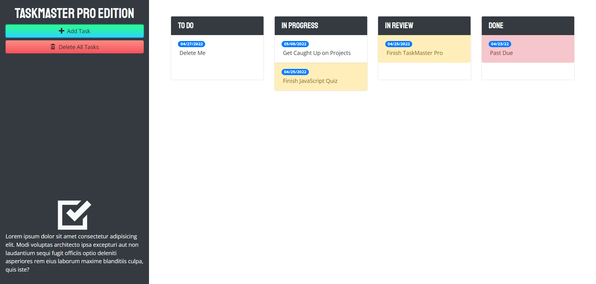
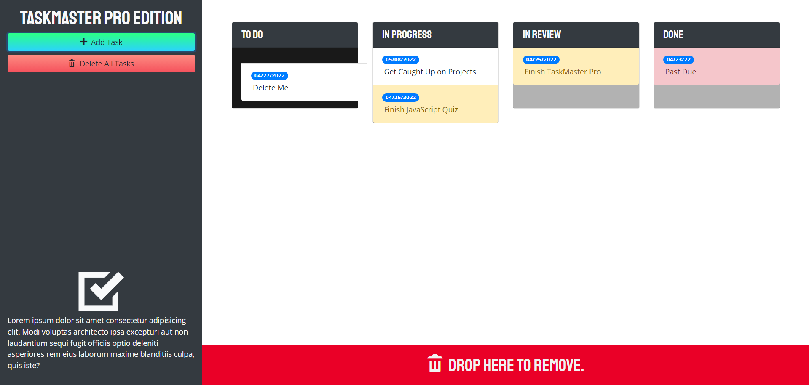

# Taskmaster Pro

## Description

Create tasks and due dates to help organize what needs to be done and in what order. Update your tasks state by moving it between 'To Do', 'In Progress', 'In Review', and 'Done'. Color coded to alert you when a task is nearing due date or even past due.

[https://millerchase.github.io/taskmaster-pro/](https://millerchase.github.io/taskmaster-pro/)

;
;